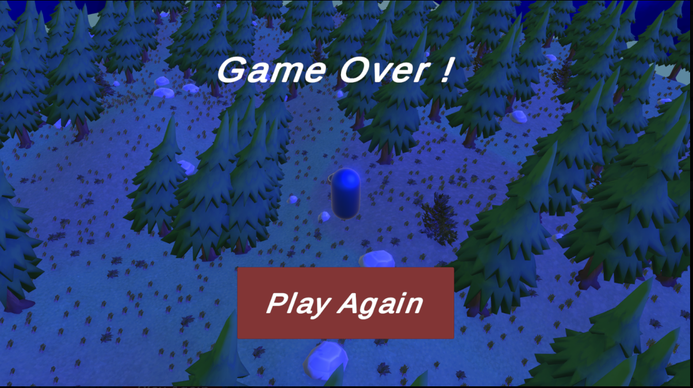

# Project-11-Unity-Shader
This project was made for the course "Shaders for Game Development" at the Gaming Campus.
The goal was to learn shader development in Unity by creating a shader that can be used in a game.

> **NOTE :** This README is more a demonstration of the project than a documentation.

## Table of Contents
- [Project-11-Unity-Shader](#project-11-unity-shader)
  - [Table of Contents](#table-of-contents)
  - [Gameplay](#gameplay)
  - [Shaders](#shaders)
    - [Map Shaders](#map-shaders)
    - [Spells Shaders](#spells-shaders)
    - [Additional game shaders](#additional-game-shaders)
  - [How to play](#how-to-play)

## Gameplay
The gameplay is really straight forward : You can move on a map & shoot at enemies. 
You have multiple skills at your disposal :
- A basic attack
- A shield 
- A shock wave that freezes enemies
- Invisibility
- A dash (not implemented yet)

  |                 Gameplay                 |              Game End               |
  |:----------------------------------------:|:-----------------------------------:|
  |  |  |

## Shaders
### Map Shaders
First, let's talk about the shaders used for the map.
Some shaders are not displayed here. They can still be found in-game.

|                            Water                             |             Wind             |
|:------------------------------------------------------------:|:----------------------------:|
|  |  |

|                Force field                 |               Crystals               |
|:------------------------------------------:|:------------------------------------:|
|   |  |

### Spells Shaders
Now, let's talk about the shaders used for the spells.

|               Shield                |                 Shock wave                 |                   Invisibility                   |
|:-----------------------------------:|:------------------------------------------:|:------------------------------------------------:|
|  |  |   |

Some spells, like dash, were not implemented. However, the shader was made.

|                             Dash Preview                              |               Dash Shader                |
|:---------------------------------------------------------------------:|:----------------------------------------:|
|  |  |

### Additional game shaders
Some shaders were made for the game itself.

|               Hit               |               Glow                |
|:-------------------------------:|:---------------------------------:|
|  |  |

|                 Dissolve                  |                 Level Up                 |
|:-----------------------------------------:|:----------------------------------------:|
|  |  |

## How to play
1. Clone the project
2. Open the project in Unity
3. Open the scene `Assets/Scenes/MainScene.unity`
4. Play the scene and enjoy the game !